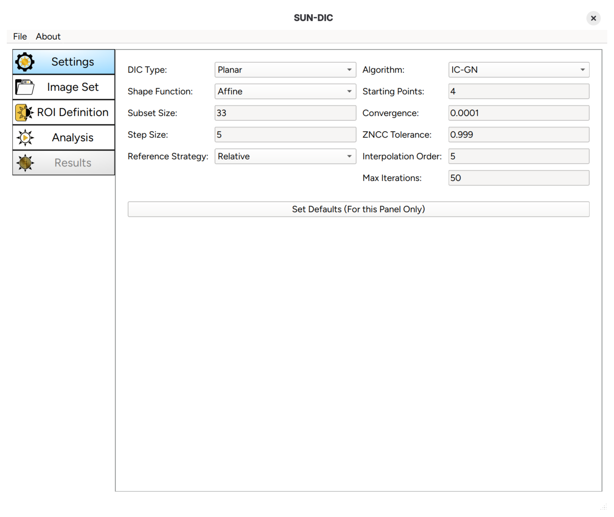
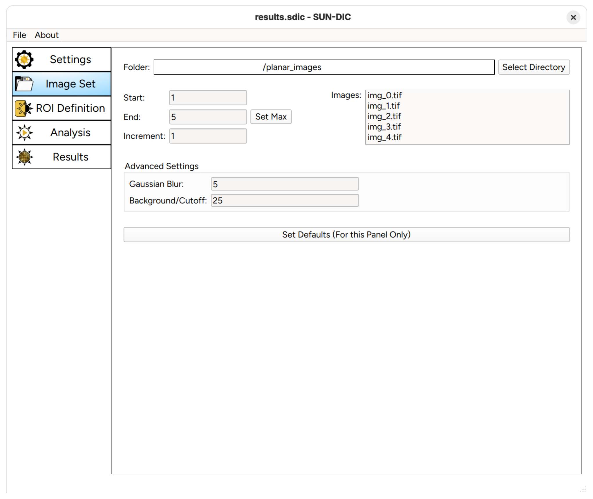
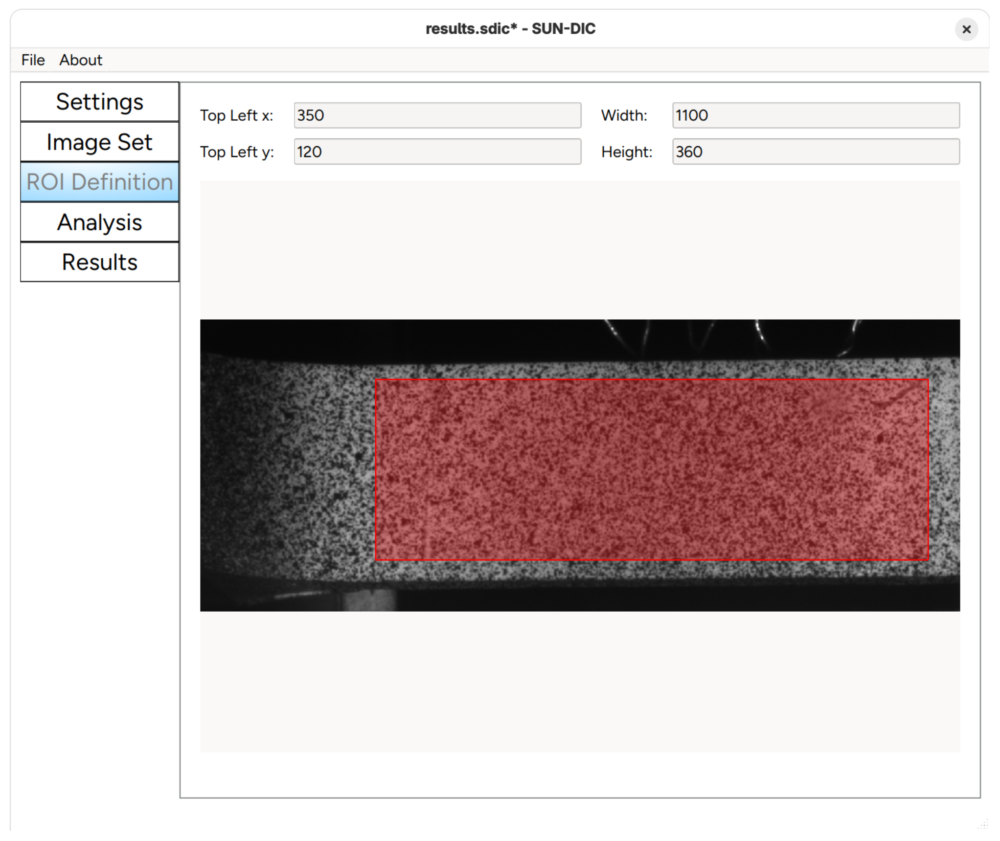
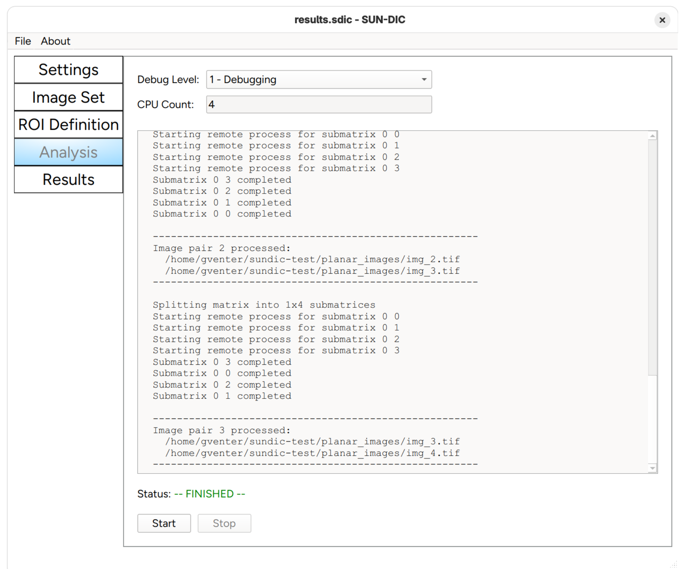
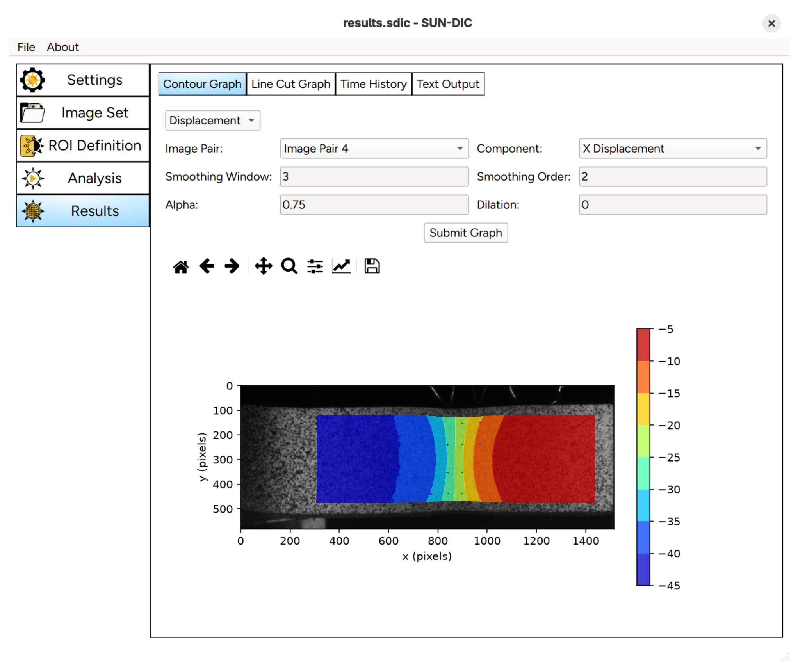

---

# SUN-DIC

**Stellenbosch University Digital Image Correlation (DIC) Code**

---

## Important Notice

This is an early release of the Stellenbosch University DIC Code, referred to as **SUN-DIC**. The code includes the following features and limitations. If you encounter issues or have suggestions for improvement, please contact the author. Additional documentation will be provided in future updates.

---

## Publications

1. [](https://www.sciencedirect.com/science/article/pii/S0965997825001814) 2025-10-14 -- Venter, Gerhard and Neaves, Melody, [*SUN-DIC: A Python-Based Open-Source Software Tool for Digital Image Correlation*](https://www.sciencedirect.com/science/article/pii/S0965997825001814), Advances in Engineering Software, Volume 211, 2025.

## Presentations

1. [](presentations/2025_sundic_mod.pdf) 2025-04-17 -- MOD Research Group Meeting - Overview of SUN-DIC

---

## Limitations

1. Currently supports only 2D planar problems (a stereo version is under development).
2. Limited documentation.  Please see the provided `settings.ini` file for a complete description of all the options or use tooltip comments in the GUI for a description of the options.  Please see below.

---

## Key Features

1. Fully open-source, utilizing standard Python libraries wherever possible.
2. Offers both a user-friendly GUI and an API for interaction.
3. Implements the Zero-Mean Normalized Sum of Squared Differences (ZNSSD) correlation criterion.
4. Features an advanced starting strategy using the AKAZE feature detection algorithm for initial guess generation.
5. Supports both linear (affine) and quadratic shape functions.
6. Includes Inverse Compositional Gauss-Newton (IC-GN) and Inverse Compositional Levenberg-Marquardt (IC-LM) solvers.
7. Provides absolute and relative update strategies for handling multiple image pairs.
8. Users can specify rectangular regions of iterest (ROI) and/or make use of a black/white mask to define a custom ROI.  White areas are analysed while black areas are ignored.  In addition, subsets with an all-black background (based on a user-defined threshold) are automatically ignored thus allowing the code to handle irregularly shaped domains automatically.
9. Computes displacements and strains and provides several graphing options to investigate the results.
10. Utilizes Savitzky-Golay smoothing for strain calculations.  Displacements can also be smoothed using the same algorithm.
11. Supports parallel computing for improved performance.
12. Easy installation via [PyPI](https://pypi.org/project/SUN-DIC/).

---

## Installation

Although installation can be performed without creating a virtual environment, it is highly recommended to use one for easier dependency management.

### General Steps

1. Create a virtual environment.
2. Activate the virtual environment.
3. Install the package from [PyPI](https://pypi.org/project/SUN-DIC/).
4. If you want to use the example Jupyter notebook, install the optional `jupyter` dependencies.
5. Copy the example problem to the current working directory by typing `copy-examples`.  A complete working example is provided by the following files:
   - `test_sundic.ipynb`
   - `settings.ini`
   - `planar_images` folder
  
  These files provide a practical starting point for using both the API or GUI.

---

### Using `pip`

1. Create a virtual environment (e.g., `sundic`):

   ```
   python3.11 -m venv sundic
   ```

2. Activate the virtual environment:

   ```
   source sundic/bin/activate
   ```

3. Install the base package:

   ```
   pip install SUN-DIC
   ```

4. Optional: install Jupyter notebook support if you want to use the Jupyter example:
   ```
   pip install "SUN-DIC[jupyter]"
   ```

5. Copy the example problem:

   ```
   copy-examples
   ```

---

### Using `conda`

1. Create a virtual environment (e.g., `sundic`) with Python pre-installed:

   ```
   conda create -n sundic python=3.11
   ```

2. Activate the virtual environment:

   ```
   conda activate sundic
   ```

3. Install the base package:

   ```
   pip install SUN-DIC
   ```
4. Optional: install Jupyter notebook support if you want to use the Jupyter example:
   ```
   pip install "SUN-DIC[jupyter]"
   ```

5. Copy the example problem:

   ```
   copy-examples
   ```

---

### Installing Directly from GitHub (Advanced users only)

1. Create and activate a virtual environment using either `pip` or `conda` as outlined above.
2. Clone the repository and install the base package:

   ```
   git clone https://github.com/gventer/SUN-DIC.git
   pip install ./SUN-DIC
   ```

3. Optional: install Jupyter notebook support if you want to use the Jupyter example
   ```
   pip install "./SUN-DIC[jupyter]"
   ```

4. The example problem can then be found in the `SUN-DIC/sundic/examples` directory.

---

## Usage

Make sure the virtual environment where `SUN-DIC` is installed is active before proceeding.

### Starting the GUI

1. Type `sundic` in the terminal to launch the GUI.
2. Use the `copy-examples` command to copy a complete working example to the current working directory.
3. To use the provided example problem in the GUI, make use of the `Import Settings File` option in the `File` menu of the GUI to import the `settings.ini` file that comes with the example problem.  This will setup the example problem in the GUI so that it can be run from the `Analysis` window.
4. Follow the workflow outlined on the left-hand side of the GUI. Hovering over any entry provides helpful tooltips.

  
 

---

### Using the API

1. Use the `copy-examples` command to copy a complete working example to the current working directory.
2. Open the `test_sundic.ipynb` Jupyter notebook for a detailed working example.  This requires the optional Jupyter notebook dependencies to be installed with:
   ```
   pip install "SUN-DIC[jupyter]"
   ```
3. The typical workflow involves:
   - Modifying the `settings.ini` file.
   - Running the DIC analysis.
   - Post-processing the results.
4. While the example uses a Jupyter notebook, the API can also be used in standard Python `.py` scripts.

---

## API Documentation

Detailed API documentation is available at:

[https://gventer.github.io/SUN-DIC](https://gventer.github.io/SUN-DIC/)

---

## Acknowledgments

- **SUN-DIC Analysis Code**: Based on work by Ed Brisley as part of his MEng degree at Stellenbosch University. His thesis is available at the [Stellenbosch University Library](https://scholar.sun.ac.za/items/7a519bf5-e62b-45cb-82f1-11f4969da23a).
- **Interpolator**: Utilizes `fast_interp` by David Stein, licensed under Apache 2.0. Repository: [fast_interp](https://github.com/dbstein/fast_interp).
- **Smoothing Algorithm**: Implements the 2D Savitzky-Golay algorithm from the [SciPy Cookbook](https://scipy-cookbook.readthedocs.io/items/SavitzkyGolay.html).
- **GUI Development**: Initial development by [Elijah Stockhall](https://github.com/EMStockhall/).
- **Graphical Design**:  Dr Melody Neaves

---

## License

This project is licensed under the MIT License. See the `LICENSE` file for details.

---

## Authors

Developed by [Gerhard Venter](https://github.com/gventer/).

---
